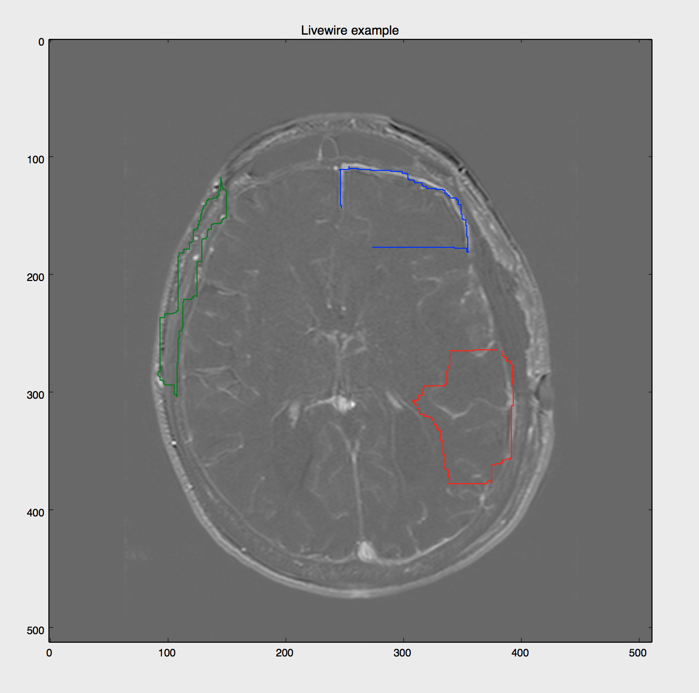

# Livewire Segmentation Algorithm
  <!---->

## Updated
The project in deep-learning-version is an expanded version of original one. Specifically,

* A new interactive GUI written by pyplot.
* Add deep learning model to provide extra gradient information, can be more accurate and be customized.
* Optimized cost function and support 8-connected graph.
* Useful for deep-learning segmentation labelling work.

---
## _Original docs_
This repository contains a working implementation of Livewire algorithm for image segmentation. The general idea of the algorithm is to use image information for segmentation and avoid crossing object boundaries. A gradient image highlights the boundaries, and Dijkstra's shrotest path algorithm computes a path using gradient differences as segment costs. Thus the line avoids strong gradients in the gradient image, which corresponds to following object boundaries in the original image.

The notebook includes a script that loads a demo DICOM image (MR head scan), and allows the user to segment a structure in the brain by setting seed points and letting Livewire algorithm compute the "best" path in regard to the underlying objects to the next seed point. The algorithm suggestions are displayed as user moves the mouse over the image.

## Technical requirements
To run this script, you will need:
- [ipython](http://ipython.org) (for Python 2.7)
- ipython notebooks, aka [Jupyter notebooks](http://jupyter.org)
- [scikit-image](http://scikit-image.org)
- [matplotlib](http://matplotlib.org)
You can get them all out-of-the-box in an [Anaconda install](https://www.continuum.io/downloads).

## Screenshot

